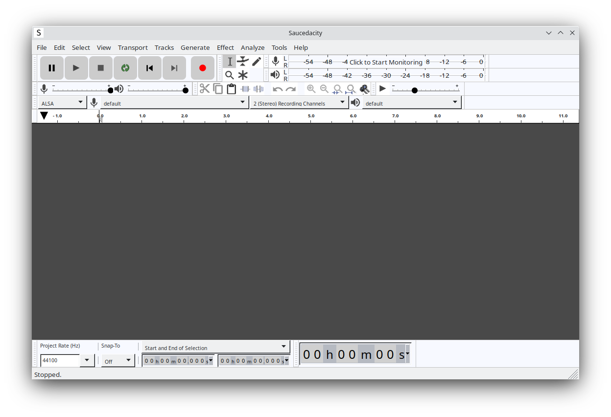

# Saucedacity

A free, open source audio editor based on Audacity. Saucedacity has the same features as Audacity except any networking and we have improvements.

# Screenshot

# Features

* Recording from any real, or virtual audio device that is available to the host system.
* Export / Import a wide range of audio formats, extendible with FFmpeg.
* High quality using 32-bit float audio processing.
* Plug-ins Support for multiple audio plug-in formats, including VST, LV2, AU.
* Macros for chaining commands and batch processing.
* Scripting in Python, Perl, or any language that supports named pipes.
* Nyquist Very powerful built-in scripting language that may also be used to create plug-ins.
* Editing multi-track editing with sample accuracy and arbitrary sample rates.
* Accessibility for VI users.
* Analysis and visualization tools to analyze audio, or other signal data.

# Releases
Be sure to check the [releases page](https://github.com/saucedacity/saucedacity/releases). The latest stable release is Saucedacity 1.2.

## System Requirements

Saucedacity runs on the following:
* Windows 7 or later (32 or 64 bit)
* macOS 10.12 or later
* Ubuntu 20.04 or later (or any equivalent distro)

**Note that you will need a CPU with SSE2 support.** This is only an issue if you are planning to run Saucedacity on older hardware.

### Note on Windows 7 Support
Windows 7 extended support ended on January 14, 2020. This means that Windows 7 will no longer receive any updates of any kind.

In response to this situation, **Saucedacity will continue to support Windows 7 until either Saucedacity/Tenacity 2.0 (the planned migraiton to Qt) or until Visual Studio drops support for Windows 7 targets**. We will fix bugs and provide updates for Windows 7 users for the forseeable future. **This policy will also apply to Windwos 8/8.1 users**.

# Contributing
Want to contribute? Feel free to! No knowledge of coding required, as we still have a couple of tasks to be done that _don't_ involve coding. For more info, see [CONTRIBUTING.md](https://github.com/saucedacity/saucedacity/blob/main/CONTRIBUTING.md). If you want to contribute code, however, you need to know C++ as Saucedacity is written in C++.

Regardless, you can find issues in our issue tracker, found [here](https://github.com/saucedacity/saucedacity/issues), that always need fixing.
